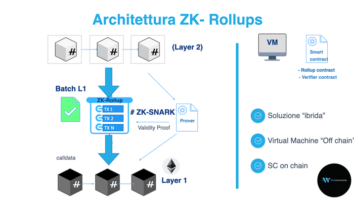
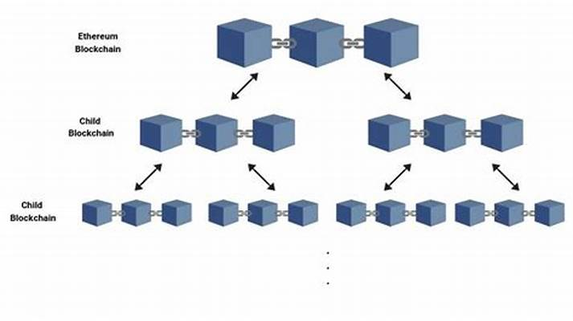

## Block Chain
- A blockchain is a growing list of records, called blocks, that are linked using cryptography. Each block contains a cryptographic hash of the previous block, a timestamp, and transaction data.

- By design, a blockchain is resistant to modification of the data. It is "an open, distributed ledger that can record transactions between two parties efficiently and in a verifiable and permanent way".

## SCALING
- Scaling refers to the ability of a blockchain network to handle a large number of transactions in a given time period.


### Chain of Blocks

#### Layer 1
Solution: Proof of Work, Proof of Stake, Delegated Proof of Stake, Proof of Authority, etc.

#### Layer 2
Solution: Zk-Rollups, Optimistic Rollups, Plasma, State Channels, Side Chains, etc.

Solution: Zk Rollups (Zero Knowledge Rollups)
```
- Zk-Rollups is a layer 2 scaling solution that allows for scaling of Ethereum by moving transactions off-chain and then submitting a proof of the transaction to the Ethereum mainnet.

How it works:
1. Aggregation Off-chain: Transactions are aggregated off-chain and then submitted to the mainnet.
2. Transaction Data: Only the transaction data is submitted to the mainnet.
3. Zero-Knowledge Proofs: A zero-knowledge proof is submitted to the mainnet to prove the validity of the transaction.
4. Data Submission: The transaction data is submitted to the mainnet and the zero-knowledge proof is submitted to prove the validity of the transaction.
5. Verification on Main Chain: The zero-knowledge proof is used to verify the validity of the transaction on the mainnet.
6. Committing to Main Chain: The transaction is committed to the mainnet and the zero-knowledge proof is used to verify the validity of the transaction.
```


Solution: Plasma
```
- Plasma is a layer 2 scaling solution that allows for scaling of Ethereum by creating a network of side chains that are connected to the Ethereum mainnet.
How it works:
1. Hierarchical Structure: Plasma chains are organized in a hierarchical structure, with each chain being connected to the mainnet.
2. Reduced main chain load: Transactions are processed on the side chains, reducing the load on the mainnet.
3. Exit Mechanism: A mechanism is used to allow users to exit the side chain and return to the mainnet. 
4. Block Validity: The validity of the blocks on the side chain is verified by the mainnet.
5. Smart Contracts Functionality: Smart contracts can be deployed on the side chains, allowing for the execution of complex transactions.
````
